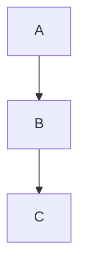
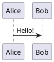

# Slidev Markdown Syntax Specification

> **Audience:** Developers building custom renderers, editors, exporters, or tooling on top of Slidev's markdown format.
>
> **Reference implementation:** [`@slidev/parser`](https://github.com/slidevjs/slidev/tree/main/packages/parser) (npm package)
>
> **Source of truth:** This spec is derived from the Slidev source code. When in doubt, the parser code is authoritative.

---

## Table of Contents

1. [Document Structure](#1-document-structure)
2. [Frontmatter](#2-frontmatter)
3. [Content Syntax](#3-content-syntax)
4. [Code Blocks](#4-code-blocks)
5. [Click Animations](#5-click-animations)
6. [Layout System](#6-layout-system)
7. [Slide Imports](#7-slide-imports)
8. [Presenter Notes](#8-presenter-notes)
9. [Image Extraction](#9-image-extraction)
10. [Feature Detection](#10-feature-detection)
11. [Programmatic API](#11-programmatic-api)
12. [Data Model Reference](#12-data-model-reference)

---

## 1. Document Structure

A Slidev document is a single `.md` file containing one or more slides separated by horizontal rules.

### 1.1 Slide Separators

Slides are separated by lines starting with three or more dashes (`---`). The separator must be the only content on the line (trailing whitespace is trimmed).

```
# First Slide

Content here

---

# Second Slide

More content

---

# Third Slide
```

**Rules:**

- The first slide does not require a leading `---`.
- A `---` line that is followed by non-empty content on the next line is treated as a **frontmatter opening delimiter** — the parser scans forward until it finds a closing `---` line.
- Lines with four or more dashes (`----`) create a new slide **without** opening a frontmatter block.
- Separators inside fenced code blocks are ignored. The parser tracks backtick fence levels to skip code blocks correctly.

### 1.2 First Slide as Headmatter

The first slide's frontmatter acts as the **headmatter** — global configuration for the entire presentation. It contains both global config fields (theme, fonts, etc.) and per-slide fields (layout, class, etc.) that apply to the first slide.

```yaml
---
theme: seriph
title: My Presentation
author: Jane Doe
layout: cover
---
# Welcome
```

### 1.3 Default Frontmatter

The headmatter supports a `defaults` key whose values are applied as default frontmatter to **all** slides:

```yaml
---
theme: default
defaults:
  layout: center
  transition: fade
---
```

---

## 2. Frontmatter

Each slide can have frontmatter in one of two styles.

### 2.1 Standard YAML Frontmatter

```
---
layout: cover
class: text-white
---

Slide content
```

### 2.2 YAML Code Block Frontmatter

````
```yaml
layout: quote
class: text-center
````

Slide content

````

The parser tries standard frontmatter first (`/^---.*\r?\n([\s\S]*?)---/`), then falls back to the YAML code block style (`/^\s*```ya?ml([\s\S]*?)```/`).

### 2.3 Per-Slide Frontmatter Fields

| Field | Type | Default | Description |
|---|---|---|---|
| `layout` | `string` | `'cover'` (first slide), `'default'` (rest) | Layout component to use. See [Layout System](#6-layout-system). |
| `class` | `string \| string[] \| Record<string, unknown>` | — | CSS classes applied to the slide root element. |
| `clicks` | `number` | auto-calculated | Total clicks needed for this slide. |
| `clicksStart` | `number` | `0` | Click count to start from. |
| `preload` | `boolean` | `true` | Preload this slide when the previous slide is active. |
| `hide` | `boolean` | — | Completely hide and disable the slide. |
| `disabled` | `boolean` | — | Same as `hide`. |
| `hideInToc` | `boolean` | — | Hide from `<Toc>` components. |
| `title` | `string` | extracted from first heading | Override slide title. |
| `level` | `number` | extracted from first heading | Override heading level for TOC. |
| `routeAlias` | `string` | — | URL alias for navigation. |
| `zoom` | `number` | `1` | Custom zoom level. |
| `clickAnimation` | `string` | — | Default click animation type. |
| `dragPos` | `Record<string, string>` | — | Positions for draggable elements. |
| `src` | `string` | — | Import slides from external file. See [Slide Imports](#7-slide-imports). |
| `transition` | `string \| TransitionGroupProps \| null` | — | Slide transition. |

### 2.4 Global Headmatter Fields

These fields are only meaningful in the first slide's frontmatter:

| Field | Type | Default | Description |
|---|---|---|---|
| `theme` | `string` | `'default'` | Theme package name. |
| `title` | `string` | `'Slidev'` | Presentation title. |
| `titleTemplate` | `string` | `'%s - Slidev'` | Template for page titles. `%s` is replaced with the slide title. |
| `author` | `string` | `''` | Author name. |
| `info` | `string \| boolean` | `false` | Additional info (supports markdown). |
| `addons` | `string[]` | `[]` | Slidev addons to load. |
| `colorSchema` | `'dark' \| 'light' \| 'all' \| 'auto'` | `'auto'` | Color scheme. |
| `highlighter` | `'shiki'` | `'shiki'` | Syntax highlighter. |
| `lineNumbers` | `boolean` | `false` | Show line numbers in code blocks globally. |
| `twoslash` | `boolean \| 'dev' \| 'build'` | `true` | Enable TypeScript TwoSlash hover. |
| `aspectRatio` | `number \| string` | `16/9` | Aspect ratio. Accepts `16/9`, `1:1`, `16x9`. |
| `canvasWidth` | `number` | `980` | Slide canvas width in px. |
| `selectable` | `boolean` | `false` | Whether text is selectable. |
| `routerMode` | `'hash' \| 'history'` | `'history'` | Vue Router mode. |
| `fonts` | `FontOptions` | `{}` | Font configuration (see below). |
| `themeConfig` | `Record<string, string \| number>` | `{}` | Theme-specific config injected as CSS variables. |
| `codeCopy` | `boolean` | `true` | Copy button in code blocks. |
| `magicMoveCopy` | `boolean \| 'final' \| 'always'` | `true` | Copy button in Magic Move blocks. |
| `magicMoveDuration` | `number` | `800` | Magic Move animation duration in ms. |
| `monaco` | `boolean \| 'dev' \| 'build'` | `true` | Enable Monaco editor. |
| `monacoTypesSource` | `'cdn' \| 'local' \| 'none'` | `'local'` | Where to load Monaco types from. |
| `comark` | `boolean` | `false` | Enable Comark (MDC) syntax extensions. |
| `presenter` | `boolean \| 'dev' \| 'build'` | `true` | Enable presenter mode. |
| `record` | `boolean \| 'dev' \| 'build'` | `'dev'` | Enable recording. |
| `remote` | `string \| boolean` | `false` | Enable remote access. String value sets password. |
| `download` | `boolean \| string` | `false` | Show download button. String value is a custom URL. |
| `editor` | `boolean` | `true` | Enable built-in editor. |
| `contextMenu` | `boolean \| 'dev' \| 'build' \| null` | `null` | Enable context menu. |
| `wakeLock` | `boolean \| 'dev' \| 'build'` | `true` | Enable wake lock. |
| `plantUmlServer` | `string` | `'https://www.plantuml.com/plantuml'` | PlantUML server URL. |
| `drawings` | `DrawingsOptions` | `{}` | Drawing configuration. |
| `favicon` | `string` | Slidev default | App favicon URL. |
| `htmlAttrs` | `Record<string, string>` | `{}` | Attributes for the HTML element. |
| `seoMeta` | `SeoMeta` | `{}` | SEO meta tags (og/twitter). |
| `duration` | `string \| number` | `'30min'` | Expected presentation duration. |
| `timer` | `'stopwatch' \| 'countdown'` | `'stopwatch'` | Timer mode. |
| `clickAnimation` | `string` | — | Default click animation globally. |
| `preloadImages` | `boolean \| { ahead?: number }` | `true` | Preload images. `true` = 3 slides ahead. |
| `transition` | `string \| TransitionGroupProps \| null` | `null` | Default slide transition. |
| `exportFilename` | `string \| null` | `''` | Override export filename (without extension). |

#### FontOptions

```typescript
interface FontOptions {
  sans?: string | string[]      // Sans-serif fonts
  serif?: string | string[]     // Serif fonts
  mono?: string | string[]      // Monospace fonts
  custom?: string | string[]    // Custom webfonts (no auto-apply)
  weights?: string | (string | number)[]  // Default: [200, 400, 600]
  italic?: boolean              // Import italic variants. Default: false
  provider?: 'none' | 'google' | 'coollabs'  // Default: 'google'
  webfonts?: string[]           // Explicit webfont names
  local?: string[]              // Local fonts excluded from webfont loading
  fallbacks?: boolean           // Use system fallback stacks. Default: true
}
````

#### Built-in Transitions

`'fade' | 'fade-out' | 'slide-up' | 'slide-down' | 'slide-left' | 'slide-right' | 'view-transition'`

---

## 3. Content Syntax

### 3.1 Base Markdown

Slide content is standard CommonMark markdown processed through markdown-it. This includes headings, paragraphs, lists, links, images, bold, italic, blockquotes, tables, etc.

### 3.2 Slot Sugar

Layouts that define named slots can be filled using the `::slotName::` shorthand syntax instead of verbose Vue `<template v-slot:...>` tags.

**Pattern:** `/^::\s*([\w.\-:]+)\s*::\s*$/` (must be the only content on a line)

```
---
layout: two-cols
---

Content for the default slot

::right::

Content for the right slot
```

This is equivalent to:

```html
<template v-slot:default="slotProps">
  <p>Content for the default slot</p>
</template>
<template v-slot:right="slotProps">
  <p>Content for the right slot</p>
</template>
```

Slot markers can appear in any order. Content before the first marker goes into the `default` slot.

### 3.3 LaTeX / KaTeX

**Inline:** `$expression$`

```
The equation $E = mc^2$ is famous.
```

**Block:**

```
$$
\begin{aligned}
\nabla \cdot \vec{E} &= \frac{\rho}{\varepsilon_0} \\
\nabla \cdot \vec{B} &= 0
\end{aligned}
$$
```

**Block with click-stepped line highlighting:**

```
$$ {1|3|all}
\begin{aligned}
\text{line 1} \\
\text{line 2} \\
\text{line 3}
\end{aligned}
$$
```

### 3.4 Comark Syntax (opt-in)

Enabled with `comark: true` in headmatter. Adds:

- **Inline attributes:** `[red text]{style="color:red"}`
- **Inline components:** `:component{prop="value"}`
- **Image attributes:** `{width=500px lazy}`
- **Block components:** `::component{prop="value"}`

### 3.5 Scoped CSS

A `<style>` block at the end of a slide applies only to that slide:

```
# My Slide

<style>
h1 { color: red; }
</style>
```

---

## 4. Code Blocks

Slidev extends standard fenced code blocks with additional metadata syntax.

### 4.1 Basic Syntax

````
```language
code here
```
````

### 4.2 Line Highlighting

Specify lines to highlight in curly braces after the language:

````
```ts {2,3}
const a = 1
const b = 2  // highlighted
const c = 3  // highlighted
```
````

**Range syntax:** Comma-separated values. Each value is a number or `start-end` range. Special values: `all` or `*` (all lines), `none` (no lines).

### 4.3 Click-Stepped Line Highlighting

Use `|` to separate highlighting states that advance with clicks:

````
```ts {2-3|5|all}
function add(a: number, b: number) {
  return a + b       // step 1: lines 2-3
}
                     // step 2: line 5
const sum = add(1, 2)
```
````

Each `|`-separated group corresponds to one click. The first group is shown initially (click 0).

### 4.4 Line Numbers

````
```ts {lines:true}
const a = 1
const b = 2
```
````

With a custom start line:

````
```ts {lines:true,startLine:5}
const a = 1
```
````

### 4.5 File Title

Square brackets after the language specify a filename shown in a title bar:

````
```ts [utils.ts]
export function add(a: number, b: number) {
  return a + b
}
```
````

Can be combined with highlighting:

````
```ts [utils.ts] {2,3}
code here
```
````

### 4.6 TwoSlash (TypeScript Hover)

````
```ts twoslash
import { ref } from 'vue'
const count = ref(0)
//     ^?
```
````

Shows TypeScript type information on hover in the rendered output.

### 4.7 Monaco Editor

**Interactive editor:**

````
```ts {monaco}
console.log('editable')
```
````

**Diff editor:**

````
```ts {monaco-diff}
const a = 1
~~~
const a = 2
```
````

The `~~~` separator divides the original (left) and modified (right) content.

**Runnable editor:**

````
```ts {monaco-run}
console.log('runs in browser')
```
````

**Editor options** (after the closing brace):

````
```ts {monaco} {height:'auto'}
code here
```
````

### 4.8 Shiki Magic Move

Animates code transitions between multiple steps using 4-backtick fences:

`````
````md magic-move
```ts
const x = 1
```

```ts
const x = 2
console.log(x)
```
````
`````

**With options:**

`````
````md magic-move {lines: true, at: 2}
```ts {*|1|2-3}
step 1
```

```ts {*|1-2|3}
step 2
```
````
`````

**With title bar:**

`````
````md magic-move [app.ts]
...
````
`````

Options: `at` (click position), `lines` (line numbers), title via `[filename]`.

### 4.9 Mermaid Diagrams

````

````

### 4.10 PlantUML Diagrams

````

````

Uses the `plantUmlServer` configured in headmatter.

### 4.11 Code Snippet Imports

Import code from external files:

```
<<< @/snippets/example.ts
```

**Pattern:** `/^<<<[ \t]*(\S.*?)(#[\w-]+)?[ \t]*(?:[ \t](\S+?))?[ \t]*(\{.*)?$/`

**Components:**

1. **Path** (required): `@/` resolves to project root. Relative paths resolve to the slide file's directory.
2. **Region** (optional): `#regionName` — extracts a named region from the file using standard comment-based region markers (`// #region name` / `// #endregion`, `<!-- #region -->`, `# region`, etc.).
3. **Language** (optional): Overrides the language inferred from the file extension.
4. **Meta** (optional): Code block options in curly braces.

**Examples:**

```
<<< @/snippets/example.ts#setup ts {2,3}
<<< @/snippets/example.ts {monaco}{height:200px}
<<< @/snippets/example.ts#myRegion
```

All code block features (highlighting, line numbers, Monaco) work with imported snippets.

---

## 5. Click Animations

Click animations control progressive reveal of content. They are implemented as Vue components/directives in the rendered output, but the syntax is part of the markdown content.

### 5.1 `v-click`

**As a component:**

```html
<v-click>Content appears after 1 click</v-click>
```

**As a directive:**

```html
<div v-click>Appears after 1 click</div>
```

**Absolute positioning:**

```html
<div v-click="3">Appears at click 3</div>
```

**Relative positioning:**

```html
<div v-click="'+1'">1 click after previous</div>
<div v-click="'-1'">1 click before previous</div>
```

**Range (show from click A to click B):**

```html
<div v-click="[2, 4]">Visible at clicks 2-3, hidden at 4</div>
```

**Hide modifier (visible first, hidden after click):**

```html
<div v-click.hide>Visible initially, hidden after click</div>
<v-click hide>Same behavior</v-click>
```

### 5.2 `v-after`

Shows at the same click as the previous `v-click`:

```html
<div v-click>Hello</div>
<div v-after>World (appears together with Hello)</div>
```

### 5.3 `v-clicks`

Applies `v-click` to each direct child element:

```html
<v-clicks> - Item 1 (click 1) - Item 2 (click 2) - Item 3 (click 3) </v-clicks>
```

**With depth (nested lists):**

```html
<v-clicks depth="2"> - Item 1 - Sub-item 1.1 - Sub-item 1.2 - Item 2 </v-clicks>
```

**Every N items per click:**

```html
<v-clicks every="2"> - Items 1-2 (click 1) - - Items 3-4 (click 2) - </v-clicks>
```

### 5.4 Draggable Elements

**Component:**

```html
<v-drag pos="squareId" text-3xl> Draggable content </v-drag>
```

**Directive:**

```html

```

Position format: `[left, top, width, height, rotation]`. Positions stored in `dragPos` frontmatter.

---

## 6. Layout System

### 6.1 Built-in Layouts

```
404 | center | cover | default | end | error | fact | full
iframe-left | iframe-right | iframe | image-left | image-right
image | intro | none | quote | section | statement
two-cols-header | two-cols
```

The `layout` frontmatter field selects the layout. Defaults to `'cover'` for the first slide and `'default'` for all others.

### 6.2 Layout Slots

Layouts expose named slots. Use [slot sugar](#32-slot-sugar) (`::name::`) to fill them:

```
---
layout: two-cols
---

Left column content

::right::

Right column content
```

### 6.3 Custom Layouts

Themes and addons can provide additional layouts. Custom layouts in the project go in `layouts/` directory.

---

## 7. Slide Imports

### 7.1 Importing from External Files

Use the `src` frontmatter field to import all slides from another file:

```yaml
---
src: ./chapter2.md
---
```

### 7.2 Importing Specific Slides

Append `#rangeString` to select specific slides:

```yaml
---
src: ./presentation.md#2,5-7
---
```

This imports slides 2, 5, 6, and 7 from the target file.

**Range syntax:** Comma-separated values. Each value is a number or `start-end` range.

### 7.3 Path Resolution

- Paths starting with `/` resolve relative to the project root (`userRoot`).
- Relative paths resolve relative to the current markdown file's directory.

### 7.4 Frontmatter Override

When importing, the importing slide's frontmatter (excluding `src`) is merged on top of each imported slide's frontmatter. This allows overriding layout, class, etc.:

```yaml
---
src: ./shared/intro.md
layout: center
class: special
---
```

---

## 8. Presenter Notes

### 8.1 Basic Notes

The last HTML comment block at the end of a slide becomes the presenter note:

```
# Slide Title

Content here

<!-- This is a presenter note. It supports **markdown**. -->
```

Only the final comment that extends to the end of the slide content is extracted as a note. Earlier comments remain in the content.

### 8.2 Click-Synchronized Notes

Use `[click]` markers within notes to synchronize note sections with slide clicks:

```html
<!--
Notes shown before any clicks.

[click] Notes shown after 1st click.

[click] Notes shown after 2nd click.

[click:3] Notes shown after 3rd click (skips one).
-->
```

---

## 9. Image Extraction

The parser extracts image URLs at parse time from multiple sources. This supports preloading and export.

### 9.1 Sources

| Source              | Pattern                                  | Example                     |
| ------------------- | ---------------------------------------- | --------------------------- |
| Frontmatter keys    | `image`, `backgroundImage`, `background` | `image: /hero.png`          |
| Markdown images     | ``                            | ``        |
| Vue component props | `src="url"`, `image="url"`               | ``    |
| Vue bound props     | `:src="'/url'"`                          | `` |
| CSS url()           | `url(path)`                              | `background: url(/bg.png)`  |

### 9.2 Filtering

- `data:` URIs are excluded.
- Dynamic Vue bindings (`{{ }}`) are excluded.
- For `background` frontmatter: only included if it looks like an image (has an image extension or starts with `/` or `http`).
- The `background` key filters by image extension: `.png`, `.jpg`, `.jpeg`, `.gif`, `.svg`, `.webp`, `.avif`, `.ico`, `.bmp`, `.tiff`.
- Content inside fenced code blocks is stripped before extraction to avoid false positives.

---

## 10. Feature Detection

The parser scans slide content to detect which optional features are used. This allows the runtime to conditionally load heavy dependencies.

````typescript
interface SlidevDetectedFeatures {
  katex: boolean // Content contains $ or $$
  monaco:
    | false
    | {
        // Content contains {monaco...} in code blocks
        types: string[] // Referenced module specifiers (for type loading)
        deps: string[] // Dependencies for monaco-run blocks
      }
  tweet: boolean // Content contains <Tweet
  mermaid: boolean // Content contains ```mermaid
}
````

Detection is regex-based and runs against the raw markdown content.

---

## 11. Programmatic API

### 11.1 Package: `@slidev/parser`

Install:

```bash
npm install @slidev/parser
```

### 11.2 Core Functions

#### `parse(markdown, filepath, extensions?, options?)`

Async parser with support for preprocessor extensions.

```typescript
function parse(
  markdown: string,
  filepath: string,
  extensions?: SlidevPreparserExtension[],
  options?: SlidevParserOptions,
): Promise<SlidevMarkdown>
```

#### `parseSync(markdown, filepath, options?)`

Synchronous parser (no extension support).

```typescript
function parseSync(
  markdown: string,
  filepath: string,
  options?: SlidevParserOptions,
): SlidevMarkdown
```

#### `parseSlide(raw, options?)`

Parse a single slide's raw text into its components.

```typescript
function parseSlide(
  raw: string,
  options?: SlidevParserOptions,
): Omit<SourceSlideInfo, 'filepath' | 'index' | 'start' | 'contentStart' | 'end'>
```

#### `stringify(data)`

Convert parsed data back to markdown (round-trip).

```typescript
function stringify(data: SlidevMarkdown): string
```

#### `detectFeatures(code)`

Scan content for optional feature usage.

```typescript
function detectFeatures(code: string): SlidevDetectedFeatures
```

#### `extractImagesUsage(content, frontmatter)`

Extract image URLs from content and frontmatter.

```typescript
function extractImagesUsage(content: string, frontmatter: Record<string, any>): string[]
```

#### `resolveConfig(headmatter, themeMeta?, filepath?, verify?)`

Resolve final configuration by merging headmatter, theme defaults, and global defaults.

```typescript
function resolveConfig(
  headmatter: any,
  themeMeta?: SlidevThemeMeta,
  filepath?: string,
  verify?: boolean,
): SlidevConfig
```

#### `getDefaultConfig()`

Returns the default configuration object.

```typescript
function getDefaultConfig(): SlidevConfig
```

#### `parseRangeString(total, rangeStr?)`

Parse a range string into an array of numbers.

```typescript
function parseRangeString(total: number, rangeStr?: string): number[]
// "1,3-5,8" with total=10 => [1, 3, 4, 5, 8]
// "all" or "*" => [1, 2, ..., total]
// "none" => []
```

#### `parseAspectRatio(value)`

Parse aspect ratio from various formats.

```typescript
function parseAspectRatio(str: string | number): number
// "16/9" => 1.777...
// "1:1"  => 1
// "16x9" => 1.777...
```

### 11.3 Filesystem Functions (`@slidev/parser/fs`)

#### `load(userRoot, filepath, sources?, mode?)`

Load a full presentation, resolving `src` imports recursively.

```typescript
function load(
  userRoot: string,
  filepath: string,
  sources?: Record<string, string> | ((path: string) => Promise<string>),
  mode?: string,
): Promise<LoadedSlidevData>
```

Returns `SlidevData` without `config` and `themeMeta` (those require theme resolution).

#### `save(markdown)`

Write parsed markdown back to disk.

```typescript
function save(markdown: SlidevMarkdown): Promise<string>
```

### 11.4 Parser Options

```typescript
interface SlidevParserOptions {
  noParseYAML?: boolean // Skip YAML parsing (keep raw strings)
  preserveCR?: boolean // Preserve \r in line splitting
}
```

### 11.5 Preprocessor Extensions

Register custom transformations that run before the main parser:

```typescript
interface SlidevPreparserExtension {
  name?: string
  transformRawLines?: (lines: string[]) => Promise<void> | void
  transformSlide?: (content: string, frontmatter: any) => Promise<string | undefined>
  transformNote?: (note: string | undefined, frontmatter: any) => Promise<string | undefined>
}
```

Hooks:

- `transformRawLines`: Modify the raw line array before slide splitting.
- `transformSlide`: Transform slide content after parsing. Return `undefined` to leave unchanged.
- `transformNote`: Transform presenter notes after parsing.

---

## 12. Data Model Reference

### 12.1 SlidevMarkdown

Represents a single parsed markdown file.

```typescript
interface SlidevMarkdown {
  filepath: string
  raw: string
  slides: SourceSlideInfo[]
  errors?: { row: number; message: string }[]
}
```

### 12.2 SourceSlideInfo

A slide as it exists in the source markdown file.

```typescript
interface SourceSlideInfo extends SlideInfoBase {
  filepath: string // Source file path
  index: number // Index within the file (0-based)
  start: number // Start line in the file
  contentStart: number // Line where content begins (after frontmatter)
  end: number // End line in the file
  raw: string // Raw text including frontmatter
  contentRaw: string // Content before preprocessor transforms
  imports?: SourceSlideInfo[] // Slides imported via src
  frontmatterDoc?: YAML.Document // Parsed YAML document (for editing)
  frontmatterStyle?: 'frontmatter' | 'yaml' // Which syntax was used
}
```

### 12.3 SlideInfo

A slide in the resolved presentation (after import resolution, disabled slides filtered out).

```typescript
interface SlideInfo extends SlideInfoBase {
  index: number // Index in the presentation (0-based)
  importChain?: SourceSlideInfo[] // Chain of importers ([] for entry file)
  source: SourceSlideInfo // Reference to the source slide
  noteHTML?: string // Rendered note HTML
}
```

### 12.4 SlideInfoBase

Shared fields between source and resolved slides.

```typescript
interface SlideInfoBase {
  revision: string // Content hash for change detection
  frontmatter: Record<string, any> // Parsed frontmatter
  content: string // Markdown content (without frontmatter/notes)
  frontmatterRaw?: string // Raw YAML string
  note?: string // Presenter note text
  title?: string // Slide title (from frontmatter or first heading)
  level?: number // Heading level
  images?: string[] // Extracted image URLs
}
```

### 12.5 SlidevData

Complete parsed presentation.

```typescript
interface SlidevData {
  slides: SlideInfo[] // Renderable slides (disabled excluded)
  entry: SlidevMarkdown // Entry markdown file
  config: SlidevConfig // Resolved configuration
  headmatter: Record<string, unknown> // Raw global config from first slide
  features: SlidevDetectedFeatures // Detected optional features
  themeMeta?: SlidevThemeMeta // Theme metadata
  markdownFiles: Record<string, SlidevMarkdown> // All loaded markdown files
  watchFiles: Record<string, Set<number>> // Files to watch for HMR
}
```

### 12.6 SlidePatch

Editable fields for hot module replacement.

```typescript
type SlidePatch = Partial<Pick<SlideInfoBase, 'content' | 'note' | 'frontmatterRaw'>> & {
  skipHmr?: boolean
  frontmatter?: Record<string, any> // Partial patch (null to delete a field)
}
```

### 12.7 Data Flow

```
                    ┌─────────────────────┐
                    │   Raw Markdown (.md) │
                    └─────────┬───────────┘
                              │
                    ┌─────────▼───────────┐
                    │  parseSync() / parse()│  @slidev/parser
                    │  Split into slides   │
                    │  Extract frontmatter │
                    │  Extract notes       │
                    │  Extract images      │
                    └─────────┬───────────┘
                              │
                    ┌─────────▼───────────┐
                    │   SlidevMarkdown     │
                    │   { slides: [] }     │
                    └─────────┬───────────┘
                              │
                    ┌─────────▼───────────┐
                    │      load()          │  @slidev/parser/fs
                    │  Resolve src imports │
                    │  Filter disabled     │
                    │  Merge frontmatter   │
                    └─────────┬───────────┘
                              │
                    ┌─────────▼───────────┐
                    │  LoadedSlidevData    │
                    │  (no config yet)     │
                    └─────────┬───────────┘
                              │
                    ┌─────────▼───────────┐
                    │  resolveConfig()     │  Theme + defaults
                    └─────────┬───────────┘
                              │
                    ┌─────────▼───────────┐
                    │     SlidevData       │
                    │  (complete, ready    │
                    │   for rendering)     │
                    └─────────────────────┘
```

---

## Appendix: Quick Reference

### Slide Separator

```
---
```

### Frontmatter (two styles)

````yaml
---                          ```yaml
key: value                   key: value
---                          ```
````

### Code Block Features

| Feature        | Syntax                          |
| -------------- | ------------------------------- |
| Line highlight | ` ```ts {2,3} `                 |
| Click steps    | ` ```ts {2-3\|5\|all} `         |
| Line numbers   | ` ```ts {lines:true} `          |
| File title     | ` ```ts [file.ts] `             |
| Monaco editor  | ` ```ts {monaco} `              |
| Monaco diff    | ` ```ts {monaco-diff} `         |
| Monaco run     | ` ```ts {monaco-run} `          |
| TwoSlash       | ` ```ts twoslash `              |
| Mermaid        | ` ```mermaid `                  |
| PlantUML       | ` ```plantuml `                 |
| Magic Move     | ` ````md magic-move `           |
| Snippet import | `<<< @/path#region lang {meta}` |

### Click Animations

| Syntax             | Effect                        |
| ------------------ | ----------------------------- |
| `v-click`          | Show after next click         |
| `v-click="3"`      | Show at click 3               |
| `v-click="'+2'"`   | Show 2 clicks after previous  |
| `v-click="[2, 4]"` | Show at clicks 2-3, hide at 4 |
| `v-click.hide`     | Hide after next click         |
| `v-after`          | Show with previous v-click    |
| `<v-clicks>`       | Auto-click each child         |

### Slot Sugar

```
::slotName::
```
